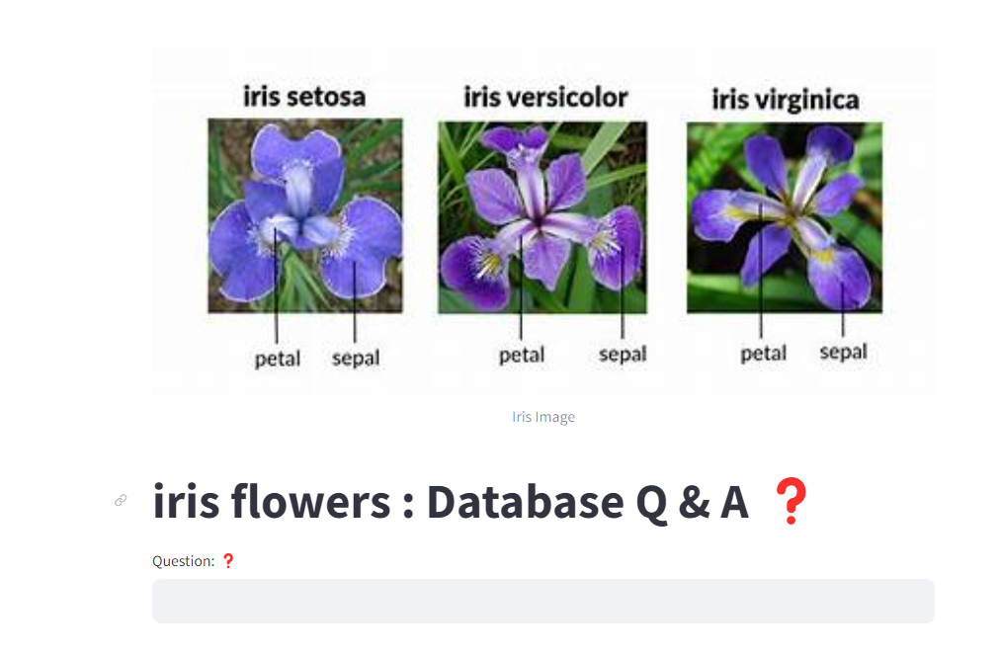

# GenAI-RAG-SQL

# Iris: Talk to a Database  

This is an end to end LLM project based on Google Gemini and Langchain. We are building a system that can talk to MySQL database. 
User asks questions in a natural language and the system generates answers by converting those questions to an SQL query and
then executing that query on MySQL database. 

Iris is popular dataset in MySQL database. 
will may ask questions such as,
- find the distinct species in the table?
- count the number of entries in the table?
The system is intelligent enough to generate accurate queries for given question and execute them on MySQL database



## Project Highlights


- We will build an LLM based question and answer system that will use following,
  - Google Gemini LLM
  - Hugging face embeddings
  - Streamlit for UI
  - Langchain framework
  - Chromadb as a vector store
  - Few shot learning
- In the UI,  One will ask questions in a natural language and it will produce the answers


## Installation

1.Clone this repository to your local machine using:

```bash
  git clone https://github.com/alexvatti/GenAI-RAG-SQL.git
```
2.Navigate to the project directory:

```bash
  cd GenAI-RAG-SQL
```
3. Install the required dependencies using pip:

```bash
  pip install -r requirements.txt
```
4.Acquire an api key from google ai studio & SQL PW and put it in .env file

```bash
  GOOGLE_API_KEY="your_api_key_here"
  SQL_PW="your_password_key_here"
```


## Usage

1. Run the Streamlit app by executing:
```bash
streamlit run app.py

```

2.The web app will open in your browser where you can ask questions

## Sample Questions
  - How many total entries are there in table?
  - How many different species are there in the table?
  - What are the flower names in the table?
  - what is the minimum value of petal length?
  - what is the maximum value of petal length?